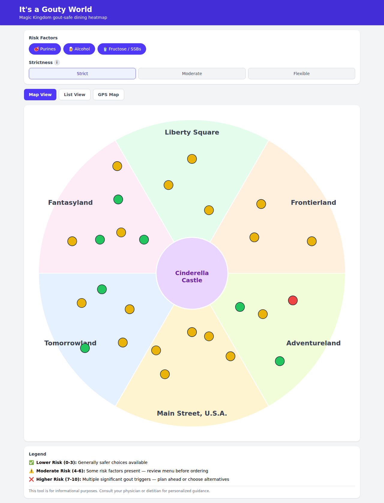

# It's a Gouty World 🏰

**A gout-safe dining heatmap for Magic Kingdom.**

An interactive React app that visualizes every Magic Kingdom eatery on a
risk heatmap for patients managing recurring gouty arthritis. Toggle three
independent gout risk factors — **purines**, **alcohol**, and
**fructose/SSBs** — and watch each venue's risk rating update in real time,
on both a hub-and-spoke park map and a sortable list view.

Built for patients, caregivers, and clinicians planning a park visit around
dietary triggers.

> ⚠️ **Medical disclaimer:** This tool is for informational purposes only and
> does not replace clinical dietary counseling. Consult your physician or a
> registered dietitian for personalized guidance.

---

## Screenshot



*(Add a screenshot to `docs/screenshot-map.png` after your first deploy.)*

---

## How it works

1. **Toggle risk factors** — turn purines, alcohol, and/or fructose/SSBs on
   or off. Only active factors count toward each venue's score.
2. **Pick a strictness mode** — *Strict* weighs all three factors equally;
   *Moderate* and *Flexible* progressively de-emphasize alcohol and
   fructose for patients with well-controlled gout.
3. **Browse the abstract map, GPS map, or list** — venues are color-coded
   green (lower risk), yellow (moderate risk), or red (higher risk), with
   ✅ ⚠️ ❌ icons for colorblind accessibility. The GPS Map tab plots venues
   on a real OpenStreetMap base layer.
4. **Tap a venue** for a score breakdown, higher/lower-risk menu
   highlights, and a link to the official Disney menu page.

See [`docs/scoring_methodology.md`](docs/scoring_methodology.md) for the
full clinical rationale and citations behind the scoring model.

> ⚠️ **GPS Map note:** The `gps_coords` in `src/data/venues.json` are
> approximate placeholders derived from the venue's position within its
> land relative to a verified Cinderella Castle anchor point — they have
> **not** been checked against satellite imagery or surveyed park data.
> Do not use the GPS Map for in-park navigation until these are verified
> (e.g., against OpenStreetMap node positions or on-site GPS readings).

---

## Running locally

Requires Node.js 20+.

```bash
npm install
npm run dev
```

Then open the printed local URL (e.g. `http://localhost:5173/Its-A-Gouty-World/`).

To build a production bundle:

```bash
npm run build
npm run preview
```

---

## Data sources

- **Purine content:** Kaneko K, et al. *Handbook of Purine Content in Food*
  (2014) — digitized in [`data_sources/kaneko_purines.csv`](data_sources/kaneko_purines.csv).
- **Dietary risk evidence:** Choi HK, et al. *Purine-rich foods, dairy and
  protein intake, and the risk of gout in men.* N Engl J Med. 2004;
  Choi HK, Curhan G. *Alcohol intake and risk of incident gout in men.*
  Lancet. 2004; Choi JW, et al. *Sugar-sweetened soft drinks, diet soft
  drinks, and serum uric acid level.* Arthritis Rheum. 2008.
- **Clinical guidelines:** Neogi T, et al. *2020 American College of
  Rheumatology Guideline for the Management of Gout.*
- **Menu data:** Publicly available Magic Kingdom dining menus
  (`disney_url` on each venue). Current `src/data/venues.json` and
  `src/data/menu_items.json` entries are **manually estimated** and marked
  `"estimated": true` — see
  [`docs/scoring_methodology.md`](docs/scoring_methodology.md) for details
  and limitations.

### Regenerating the dataset

The `scripts/` directory contains a (not yet run) data pipeline:

```bash
pip install -r scripts/requirements.txt
python3 scripts/scrape_disney_menus.py   # scrape live Disney dining pages
python3 scripts/enrich_usda.py           # enrich with USDA FoodData Central
python3 scripts/build_dataset.py         # rebuild venues.json / menu_items.json
```

If Disney's site blocks scraping, fall back to manually updating
`src/data/venues.json` and `src/data/menu_items.json`.

---

## Reporting menu changes

Disney's menus change seasonally. If you spot an outdated `last_verified`
date, a discontinued item, or a venue that's missing, please
[open an issue](../../issues/new) with:

- The venue name and `id` from `src/data/venues.json`
- What changed (new/removed item, alcohol availability, etc.)
- A link to the current official menu page, if available

---

## Tech stack

- [React 19](https://react.dev/) + [Vite](https://vite.dev/)
- [Tailwind CSS v4](https://tailwindcss.com/)
- [Recharts](https://recharts.org/) for the score breakdown chart
- No external map library — the park map is an original SVG (no Disney
  artwork is used)
- Fully static, no backend — all data is baked into the build

---

## License

MIT — see [LICENSE](LICENSE).
